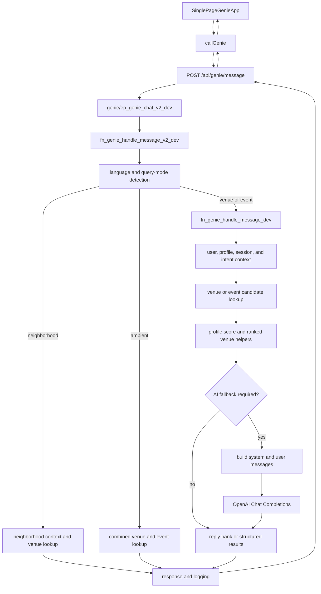

# Genie Initial Chat Workflow

**Scope:** Web chat path inspected on 2026-10-05, including the Next.js app and Xano workspace `Social Bees` (workspace 1), branch `flutter-v2-sandbox`. This documents the inspected code paths, not production traffic. No Xano objects were changed.

## Overview

The browser does not call OpenAI directly. It sends the user's message to a Next.js route, which proxies to Xano. Xano classifies the request, resolves context, fetches/ranks candidates, optionally asks OpenAI to phrase a response, then returns structured venue/event results and reply metadata. The app normalizes the response and renders either cards or a text reply.

## 1. Browser Request

`SinglePageGenieApp` calls `callGenie` in `app/lib/genieClient.ts`. It provides the message and may include:

- Channel, external user ID, and display name.
- Session token and optional Xano session ID/query number.
- City context and location coordinates, unless an explicit city should take precedence.
- Search radius (defaults to 2,500 meters).

`callGenie` posts JSON to `/api/genie/message`. It includes an app bearer token when available. It does not send prior chat turns as a conversation transcript.

## 2. Next.js Message Route

`app/api/genie/message/route.ts` is an adapter/proxy, not the system prompt or core recommendation engine. It:

1. Resolves an optional authenticated user and normalizes user ID/name, message, location, and session fields.
2. Rejects an empty message with HTTP 400.
3. Calls `genie/ep_genie_chat_v2_dev` through `xanoFetch`.
4. Normalizes venue image URLs, takes up to three featured venues and up to twelve more nearby venues, and passes through event results.
5. Preserves Xano's `query_mode` and `reply_mode`, and derives the app-facing `response_mode`: `structured_results` when venues or events exist, otherwise `text_reply`.
6. Returns session identifiers, filters, intake prompt data, and optional debug metadata.

On an Xano error, the route forwards the upstream status and error. Other errors become HTTP 500. `app/lib/genieMappers.ts` further normalizes the response and maps legacy reply modes such as `has_results`, `supported_no_results`, `city_missing`, `city_unsupported`, and `ai_fallback` to app response states.

## 3. Xano API and Mode Routing

The app calls `Genie_Dev` API `genie/ep_genie_chat_v2_dev`. That endpoint calls `genie/fn_genie_handle_message_v2_dev` with the message, channel, identity, city/location, and session fields.

The v2 handler:

1. Detects language and calls `genie/fn_genie_detect_query_mode_dev`.
2. Receives one of four `query_mode` values: `venue` (default), `event`, `neighborhood`, or `ambient`.
3. Updates weather context.
4. Routes the mode:
   - `venue` and `event` call `genie/fn_genie_handle_message_dev`.
   - `neighborhood` calls `genie/fn_genie_get_neighborhood_context_dev` and `genie/fn_genie_get_neighborhood_venues_dev`, then uses `genie/fn_genie_get_reply_v2_dev`.
   - `ambient` calls `genie/fn_genie_get_ambient_recommendations_dev`, then uses the reply bank.
5. Returns `query_mode`, Xano `reply_mode`, text reply, venues/events, and session/context fields.

`fn_genie_detect_query_mode_dev` uses keyword checks for events and ambient requests and a hard-coded Houston neighborhood list. Neighborhood detection can override event classification; ambient detection runs after both. This is classification logic in Xano, not a model tool call.

The names `reply_mode` and `response_mode` are different contracts. Xano returns `reply_mode`; the Next.js route derives `response_mode` for the frontend.

## 4. User, Session, and Intent Setup

The venue/event handler `genie/fn_genie_handle_message_dev` performs the detailed request setup. The inspected call path includes:

- `fn_genie_detect_language_dev` and `fn_resolve_nearest_city_dev`.
- `fn_genie_identify_user_dev` and `fn_genie_get_or_create_user_profile_dev`.
- Social-profile and tag-preference reads.
- `fn_genie_get_or_create_session_dev` and `fn_genie_log_message_dev` for session/message handling.
- `fn_genie_parse_intent_dev` for filters and intent metadata.

The endpoint accepts `session_token`, `session_id`, and `session_query_number`; the inspected request does not carry explicit `active_topic`, `last_shown`, or `origin` fields described as future conversation state in the plan. Although messages and queries are persisted, the inspected payload builder includes the current request/context, not a prior-message transcript.

## 5. Candidate Lookup and Internal "Tools"

Before any AI fallback, Xano performs retrieval and ranking itself:

- Event requests query `genie_social_events`.
- Venue requests query `genie_venues`, use `fn_genie_profile_score_venue_dev` for a profile bonus, and may invoke `fn_genie_ranked_venue_search_wrapped_dev`.
- The ranked-search wrapper calls `fn_genie_ranked_venue_search_dev`, hydrates IDs through `fn_genie_hydrate_ranked_venues_dev`, and builds reply/card information through `fn_genie_build_venue_reply_from_list_dev`.
- Candidate and result checks determine whether Xano can return structured results, needs a city/location clarification, or should fall back to AI.

These are **Xano function calls inside the backend**, sometimes called tools informally. They are not OpenAI function/tool calls. The inspected OpenAI request includes `model`, `messages`, `temperature`, and `max_tokens`; it has no `tools` or `tool_choice` parameter.

## 6. System Text and AI Fallback

The base prompt is assembled line by line into `$system_text` in `genie/fn_genie_build_ai_payload_dev`. It contains:

- Genie role and brand voice.
- Language matching and translation rules.
- Hard rules against fabricating facts or exposing internal tools.
- Behavior for `city_missing`, `city_unsupported`, `supported_no_results`, and `has_results`.
- Formatting rules, including when to mention result cards.

The builder creates a system message plus one user-context message. That context includes reply mode, city, whether results exist, current request, intent snapshot, a preview of up to five venue names/neighborhoods, and coordinates when present.

When the legacy handler's AI gate allows a fallback, it calls:

1. `genie/fn_genie_build_ai_payload_dev`.
2. `genie/fn_genie_call_ai_dev`.

`fn_genie_call_ai_dev` posts to OpenAI Chat Completions using model `gpt-4o`, temperature `0.6`, maximum `350` tokens, and a 30-second timeout. It reads `choices[0].message.content` as the assistant reply. If the call fails or returns no usable text, the handler falls back to `genie/fn_genie_get_reply_dev` and other mode-specific response handling. When supported results exist, it can replace the generated text with a short reply-bank message so the UI presents the venue cards rather than duplicating a list in prose.

### v2 Payload Wrapper

`genie/fn_genie_build_ai_payload_v2_dev` exists and can append weather, neighborhood, and ambient context to the first system message after calling the base builder. The inspected branches in `fn_genie_handle_message_v2_dev` do not directly call this wrapper, so the audit does not establish that these injections are used in the active v2 path.

## 7. Reply, Persistence, and UI Loop

Xano returns structured venues/events, reply text, mode fields, session data, and filters. The Next.js route caps/normalizes venue arrays and derives `response_mode`; `normalizeHandleMessageResponse` maps fields to `decisive`, `more_nearby`, and `events` for the UI.

For structured results, `SinglePageGenieApp` selects a first venue, records analytics, increments the local query count, and opens the decision/results screen. For a text response, it presents the relevant non-structured state. It stores the returned session token and numeric session ID for later requests.

The inspected handler logs messages through `fn_genie_log_message_dev`, adds a `genie_query_log` row, and records a behavior signal through `fn_genie_write_behavior_signal_dev`. Guest-session creation/conversion is a separate endpoint pair exposed by `app/api/genie/session/route.ts`:

- `POST genie/guest_session` creates a guest session.
- `POST genie/convert_guest_session` converts it to a user session and transfers saved venues.

## 8. Related but Separate APIs

These routes may support chat setup or feedback but are not part of every message turn:

- `app/api/genie/social-profile/route.ts` maps to `genie/get_social_profile` and `genie/update_social_profile`.
- `app/api/genie/track-signal/route.ts` maps to `genie/track_signal` for behavioral signals.
- `app/api/genie/prompt/route.ts` maps to signup/upgrade prompt visibility, logging, and dismissal. That prompt is unrelated to `$system_text`.
- Venue/event interaction logging routes support clicks and engagement outside the core chat request.

`OpenAI_ChatCompletions_JSON` is a separate endpoint in the sandbox API group. The inspected frontend does not call it. It accepts `prompt_text` and has a generic JSON-only system instruction; despite its description, the inspected endpoint script does not show `genie_session`/`genie_message` persistence. Do not confuse it with the current `ep_genie_chat_v2_dev` path.

## 9. Important Boundaries

- Scope inspected: Xano workspace `Social Bees`, branch `flutter-v2-sandbox`, and the repository's web app. Live `v1` was not inspected.
- The core prompt is Xano function code; `app/api/genie/message` only proxies and normalizes the response.
- Xano retrieval/ranking happens before the model call. The model does not select tools dynamically in the inspected request contract.
- Xano's session/message storage exists, but the inspected AI payload does not include previous turns as a transcript.
- The v2 payload wrapper exists but was not shown to be invoked by the inspected v2 handler branches.
